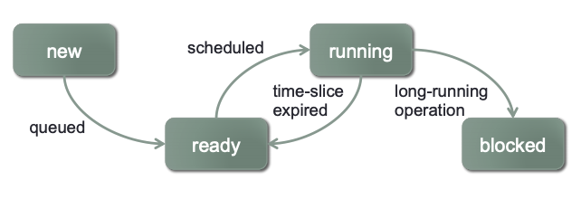

# CS-124: Operating Class from CalTech

## Protection and Security

* Feature 1: multiple processor operating modes -- kernel mode (part of OS running) + user mode
* Feature 2: virtual memory
  1. The processor maps virual address with physical address using a page table
  2. The memory management unit (MMU) performs this translation
  3. Translation Lookaside Buffer (TLB) cache page table entries to avoid memory access overhead when translating address.
  4. Only the kernel can manipulate the MMU's configuration. -- if user-mode code tries to access kernel space, processor notifies OS.
  5. Virual memory allows OS to give each process its own isolated address space.

## Console and FileIO

* read and write for standard input: 
  1. `basic_istream& read( char_type* s, std::streamsize count );`: read `count` size of input from `s`.
  2. `basic_ostream& write( const char_type* s, std::streamsize count );`: write `count` size of data input `s`.
  3. EOF indicates by 0 return-value, error indicated by values < 0.
  4. Both `read` and `write` are syscalls, which takes a long time (milliseconds or microseconds because of context switches to another proces until I/O subsystem fires an interrupt to signal completion).
  5. `filedes`: file descriptor (ID represents a specific file or device). If there are multiple files open, all the `filedes` will be stored in an array (as pointers pointing to file object). Each file consists of current read/write offset within the file.
  

## UNIX command shell Operation

1. Wait for a command to be entered on the shell's stdin
2. Tokenize the command into an array of `tokens`
3. If `token[0]` is an internal shell command, then handle the internal command and go back to 1.
4. Otherwise, `fork()` off a child process to execute the program. `wait()` for the child process to terminate, then go back to 1.

**child process**
1. If the parsed command specifies any redirection, modify stdin/stdout/stderr based on the command, and remove these tokens from the tokenized command
2. `execve()` the program specified in `tokens[0]`, passing tokens as the program’s arguments
3. If we got here, execution failed (e.g. file not found)! Report error.

## IA32 Architecture

* supports several different memory addressing mechanisms
* IA32 has a segmented memory model: mapping from logical to linear address
 - linear_address = gdt[segment_selector].base_address + offset


## Hard Disk Addressing

* Disk Sector Addressing
* Cylinder-Head-Sector (CHS) hard disk addressing:
  * BIOS generally allows disks to have up to 1024 cylinders, 255 heads, and 63 sectors/track
  * Sector is historically 512 bytes: $1024 \times 255 \times 63 \times 512=7.8 GB$  

## Process Lifecycle

### New

* Created by the OS when startup (init)
* Created when a user invokes a program via command line or GUI
* Created when a process spawns another process

### Ready and Running

* Only one process may be running on each CPU at a time
* When a process is in "running" state , it holds the CPU
* Other processes that could run, but don't currently have the CPU, are in the "ready" state

### Interaction between Ready and Running

* New processes don't necessarily get the CPU right away: initially go into ready state
* The OS only allows the currently running prcess to hold the CPU for a specific amount of time
* When time-slice exprires, running prcess is preemped and the OS chooses another process to get the CPU
* 

### Blocked

* Processes often perform long-running tasks
  * e.g. read from hard disk, network, or some other external device
  * e.g. process waits for another process (e.g. a signal or termination)
  * The process becomes **blocked** until the resource is available

* Instead of holding everyone up, kernel removes process from CPU, and chooses another ready process to run
* 
* When the long-running task is completed, the blocked process can resume execution
  * proces is moved back into the ready state
  * will eventually be chosen by the OS to run on the CPU again
  * 

### Terminated

* Processes eventually terminate
* Serveral tasks must be completed at process termination\
  * Any "at-exit" operations must be performed
  * Reclaim resources the process is still holding
  * Other processes may need to observe terminating process' status
* Processes can terminate for serveral reasons:
  * Voluntary terminate by the process itself (e.g. called `exit()` or returns from `main()`, either with success or error status
  * Involuntary termination due to an unrecoverable fault in the process (e.g. segmentation fault due to dereferencing a `NULL` pointer).
  * Involuntary termination due to a signal from another proces (e.g. another process issuess a `SIGINT(^C)`, `SIGTERM` or `SIGKILL`)
  * 

### (Additional State: ready_suspended and block_suspended)

* Ability to suspend/resume processes
  * A suspended process will not be scheduled until it is resumed
  * A user can suspend a process with e.g. Ctrl-Z at command shell
  * A process can send `SIGDTOP` to another process to suspend it

* The process being suspended might also have been blocked on a long-running operation
  * Introduce another state to manage such processes
  * 

## Process Control Block (PCB)


* Kernel manages a mapping of Process ID to Process Control Blocks
* Linux uses a hashtable, with bins containing linked-lists of PCBs

### Process Status Information

* Process control block also includes scheduling details
* Running: Process is currently running on a CPU
* Ready: Process is ready to run, but waiting for a CPU
* Blocked: Process cannot proceed until receives a recoure or a message
* Status data can be used for:
  * Specifying pending reource-request for this process
  * Specifying other processes in the same state and priority

### Process Context-Switch

* When the OS switches from running a given process, the process' context must be saved into the process' PCB

  * CPU state: registers, program counter, stack pointer, status flags

* Similarly, when the OS switches to another process, the new process' context must be restored from the PCB

* Context-swtches require a certain amount of time:

  * Entering into the kernel:
    * CPU handles the interrrupt (save prog ctr/stack, stack-switch)
    * Handler saves CPU state of current process into the process' PCB

  * Kernel often has to invoke the scheduler in order to choose what process to execute next
    * Some syscalls don't cause a context-switch, but most tend to

* Leaving the kernel:

  * kernel must restore CPU state from new process' PCB

* Kernel must also switch to new process' memory state

  * Each process has its own page-table hierarchyt in its own PCB
  * Must switch the virtual memory system to using the new process' memory mapping

* When kernel changes the memory mapping, it must also clear the **MMU's Translation Lookaside Buffers** (basically clear the cache)

* During a context-switch, the OS isn't doing useful work

  * By "useful work", we maen "running the user's application"

* Want to minimize amount of time a context-switch takes
  * e.g. make the scheduler fast, save/load CPU state fast, etc.
* Also want to minimize the frequency of context-swtiches
  * If our system performs many context-switches, it will be spending less time doing useful work

### Ready and Blocked Processes

* The OS must manage multiple collections of processes (implemented as queue)
* Processes frequently block on long-running operations
  * e.g. read data from a file on disk/CD-ROM/flash drive/etc.
  * e.g. read data from a network socket
  * e.g. wait for another process to terminate
  * Need to remove such processes from the ready queue and put them into a collectioon of blocked processes
* Blocked processes usually become unblocked in interrupt handlers
* 

## Processes and Threads

* Processes have one sequential **thread** of execution
* 

### Why Multithreaded Processes?

1. Performance (lot of ways that multithreading can improve performance)
2. A cleaner abstraction for concurrent operations

## Race Condition

A **race condition** is a scenario where:

* Two or more control paths [threads, processes, etc.] manipulate the same shared state
* The outcome is dependent on the order that the interactions take place (i.e. who winsthe race)
* Manifestation of race conditions is dependent on timing
  * They don't always happend and very hard to fix

## Critical Sections

* Race conditions can be avoided by preventing multiple control paths from acccessing shared state concurrently
  * Threads, processes, etc.
* A **critical section** is a piece of code that must not be executed concurretly by multiple control paths
* **Mutual exclusion**: carefully control entry into the critical section to allow only one thread of execution at a time
* Many different tools to enforce mutual exculusion in critical secions (semaphores, mutexes, read-write locks, etc.)
  * Generally, these locks block threads (passive waiting) until they can entre the critical section
* OS kernels frequently requrie additional tools that are compatible with use in interrupt context (i.e. nonblocking)

> two process $P_0$ and $P_1$ repeatedly entering a critical section

```c++
while (true) {
  flag[i]=true; // i=0 for P_0, i=1 for P_1;j=1-i
  turn=j; // state intention to enter critical section
  while(flag[j]&&turn==j); // wait to enter critical section
  //... critical section
  flag[i]=false;
	//... non-critical section
}
```

* a process $P_i$ can only exit the while-loop if one of these is true:
  * flag[j]==false ($P_j$ is outside te critical section)
  * turn=i (it's $P_i$'s turn to enter the critical section)

## Locks and Deadlocks

* Locking mechanisms for synchronization introduce the possibility of multiple prcesses entering into deadlock
  * A set of prcesses is **deadlockde** if each process in the set is waiting for an event that only another process in the set can cause.
* Requirements for deadlock (satisfy anyone):
  * **Mutual exclusion**: resources must be held in non-shareable mode
  * **Hold and wait**: a process must be holding one resource, and waiting to acquire another resource that is currently unavailable
  * **No preemption**: a resource cannot be preempted; the process must voluntarily release the resource
  * **Circular wait**: the set of process ${P_1, P_2,…, P_n}$ can be ordered such that $P_1$ is wating for a resource held by $P_2$, $P_2$ is waiting for a resource held by $P_3, …, P_{n-1}$ is waiting for a resource held by $P_n$ and $P_n$ is waiting for a resource held by $P_1$

* Solution for deadlock:
  * Breaking "no preemption" or the "circular wait" requirement of deadlock
  * No preemption: if a process cannot acquire a resource, it cannot lock the resource (not practical)
  * Circular wait: impose a total **ordering** over all lockable resources that all processes must follow
    * As long as resources are only locked in the total ordering, deadlock can never occur
    * If a process acquires a later resource in the ordering, must release all its locks and start over
    * Usually not imposed by the OS; must be imposed by the programmer

### Deadlock Avoidane

The system selectively fail resource requests in order to prevent deadlocks, system detects when allowing a request to block would cause a deadlock and reports an immediate failure on the request. Algorithm to use to detect deadlock: **Banker's Algorithm**.

> https://en.wikipedia.org/wiki/Banker%27s_algorithm#:~:text=The%20Banker%20algorithm%2C%20sometimes%20referred,state%22%20check%20to%20test%20for

```
Total system resources are:
A B C D
6 5 7 6
Available system resources are:
A B C D
3 1 1 2
Processes (currently allocated resources):
   A B C D
P1 1 2 2 1
P2 1 0 3 3
P3 1 2 1 0
Processes (maximum resources):
   A B C D
P1 3 3 2 2
P2 1 2 3 4
P3 1 3 5 0
Need = maximum resources - currently allocated resources
Processes (possibly needed resources):
   A B C D
P1 2 1 0 1
P2 0 2 0 1
P3 0 1 4 0
```

### Resolve Deadlock

* Semaphores are common synchronization mechanism

  * Allows two or more processes to coordinate their actions

  * Cannot use Semaphores in interrupt context

  * Two operations: `wait()` and `signal()` —> these to operations have to be enclosed in critical sections.

  * Implementation of `wait()`:

    ```
    while sem.value==0:
    	add this thread to sem.waiting list
      passively block the thread
    sem.value--
    ```

  * Implementation of `signal()`:

    ```
    sem.value++
    if sem.waiting list is not empty:
      t=remove a thread from sem.waiting
      unblock t
    ```

  * `sem.value`: how many times `wait()` can be called without blocking

    * Use it to represent how much of a given resource is available

  * Doesn't ensure mutual exclusion

  * 

