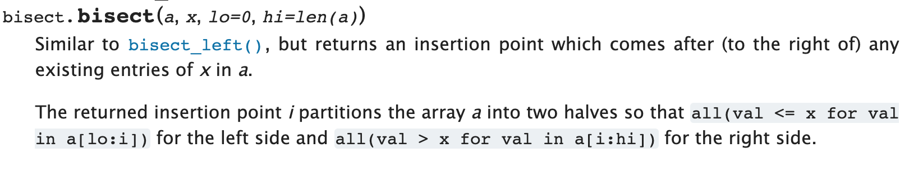

## Python Tips

### `Counter` vs `defaultdict`

> https://stackoverflow.com/a/19883180

Key difference: 

- `Counter` won't add new keys to the dict when you query for missing keys. So, if your queries include keys that may not be present in the dict then better use `Counter`.

However, `Counter` is slower than `defaultdict` :

> https://stackoverflow.com/a/27802189

### `range` keyword 

Start from 0 to 5:

```python
for i in range(0, 6):
  	print(i) ## 0, 1, 2, 3, 4, 5
```

Start from 5 to 0:

```python
for i in range(5, -1, -1):
  	print(i) ## 5, 4, 3, 2, 1, 0
```

The range is (parameter order): [start, end) and the last parameter is the increment amount

### Sorting

Python 3 doesn't encourage to use custom comparater as a function any more, and it recommended to use a lambda expression for sorting, for example:

We have a list of tuple `p`, and each tuple `p[i]` has two elements `p[i][0]` and `p[i][1]`. 

1. Default: sort the tuple `p` in increasing order, and if `p[i][0]` is equal to `p[i+1][0]`, we compare `p[i][1]` with `p[i+1][1]`, and choose the **smaller** one.
2. What if: sort the tuple `p` in increasing order, and if `p[i][0]` is equal to `p[i+1][0]`, we compare `p[i][1]` with `p[i+1][1]`, and choose the **larger** one.

```python
## 1. default sort
p.sort() ## nothing to feed the key
## 2. what if
p.sort(key = lambda x : (x[0], -x[1])) ## sort by p[i][0] in increasing order, and then sort p[i][1] in decreasing order
```

Notice the lambda expression here: on the right hand side, it feeds in to two paramters, which are actually expended by one `p[i]` because we use a parenthesis to enclose them. For each 

And there are two ways to sort, according to Python doc:

> Python lists have a built-in [`list.sort()`](https://docs.python.org/3/library/stdtypes.html#list.sort) method that modifies the list in-place. There is also a [`sorted()`](https://docs.python.org/3/library/functions.html#sorted) built-in function that builds a new sorted list from an iterable.

### Binary search

> https://docs.python.org/3/library/bisect.html




```python
def index(a, x):
    'Locate the leftmost value exactly equal to x'
    i = bisect_left(a, x)
    if i != len(a) and a[i] == x:
        return i
    raise ValueError

def find_lt(a, x):
    'Find rightmost value less than x'
    i = bisect_left(a, x)
    if i:
        return a[i-1]
    raise ValueError

def find_le(a, x):
    'Find rightmost value less than or equal to x'
    i = bisect_right(a, x)
    if i:
        return a[i-1]
    raise ValueError

def find_gt(a, x):
    'Find leftmost value greater than x'
    i = bisect_right(a, x)
    if i != len(a):
        return a[i]
    raise ValueError

def find_ge(a, x):
    'Find leftmost item greater than or equal to x'
    i = bisect_left(a, x)
    if i != len(a):
        return a[i]
    raise ValueError
```

Visually:

```
1, 1, 2, 2, 3, 4, 4, 5 find(2)
	 ^ bisect_left (<)
	    	 ^ bisect/bisect_right (<=)
```

**Note**: for `bisect` and `bisect_right` it always returns the target index + 1, so don't forget to subtract 1 from it!

### String 

#### replace by pattern/substring

`str.replace(*old*, *new*[, *count*])`

Return a copy of the string with all occurrences of substring *old* replaced by *new*. If the optional argument *count* is given, only the first *count* occurrences are replaced.

#### Check if is alpha (english letter)

`S[j].isalpha()`

