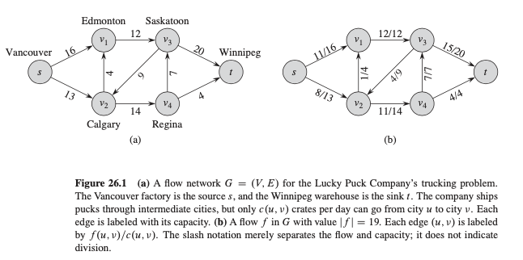
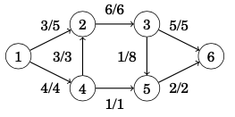
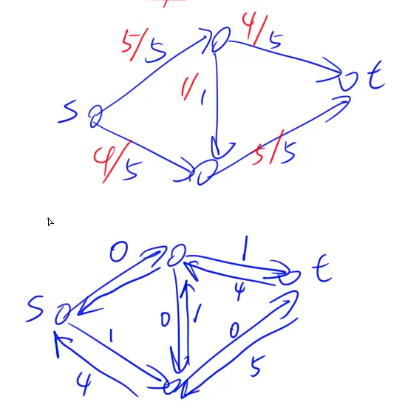

# Max Flow Problem

## Defination of Flow Network

A **flow network** $G = (V, E)$ is a directed grarph in which each edge $(u, v) \in E$ has a nonnegative **capacity** $c(u, v) \geq 0$. We further require that if **E** contains an edge $(u, v)$, then there is no edge $(u, v)$ in the reverse direction.

## Two Properties

1. Capacity constraint: For all $u, v \in V$, we require $0 \leq f(u, v) \leq c(u,v)$.
2. Flow conservation: For all $u \in V - {s, t}$, we require $\sum_{v \in V}{f(v, u)} = \sum_{v \in V}{f(u, v)}$ (sum of in == sum of out)

> reversed direction flow can be represented by adding a new node in the middle

## What is max flow?

In the maximum flow problem, our task is to send as much flow as possible from the source to the sink. The weight of each edge is a capacity that restricts the flow that can go through the edge. In each intermediate node, the incoming and outgoing flow has to be equal.
For example, the maximum size of a flow in the example graph is 7. The following picture shows how we can route the flow:

## Residual Networks

Given flow network $G$ and a flow $f$, the residual network $G_f$ consists of edges with capacities that represent how we can change the flow on edges of $G$. As an algorithm manipulates the flow, with the goal of increasing the total flow, it might need to decrease the flow on a particular edge. Sending flow back along an edge is equiva- lent to decreasing the flow on the edge, which is a necessary operation in many algorithms.

> second graph is the residual network for the first one

## Augmenting paths

Given a flow network $G = (V, E)$ and a flow $f$, an **augmenting path** p is a simple path from s to t in the residual network where each edge is greater than 0.

If there is a augmenting path, then the original flow isn't the max flow. If there is no augmenting path, then the original flow is the max flow.