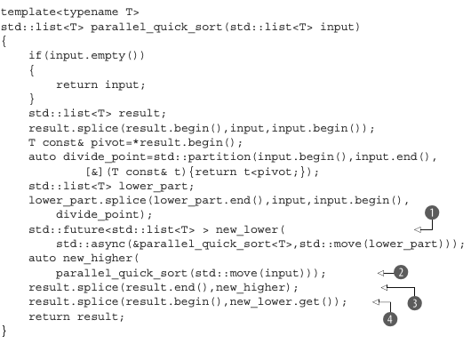

# Functional Programming in C

> content quoted from _C++ Concurreny in Action by Anthony Williams_

The term functional programming (FP) refers to a style of programming where the result of a function call depends solely on the parameters to that function and doesn’t depend on any external state. This is related to the mathematical concept of a func- tion, and it means that if you invoke a function twice with the same parameters, the result is exactly the same. This is a property of many of the mathematical functions in the C++ Standard Library, such as sin, cos, and sqrt, and simple operations on basic types, such as 3+3, 6*9, or 1.3/4.7. A pure function doesn’t modify any external state either; the effects of the function are entirely limited to the return value.

 C++ is a multiparadigm language, and it’s entirely possible to write programs in the FP style. This is even easier in C++11 than it was in C++98, with the advent of lambda functions (see appendix A, section A.6), the incorporation of std::bind from Boost and TR1, and the introduction of automatic type deduction for variables (see appendix A, section A.7). Futures are the final piece of the puzzle that makes FP-style concurrency viable in C++; a future can be passed around between threads to allow the result of one computation to depend on the result of another, without any explicit access to shared data.

1. The big change here is that rather than sorting the lower portion on the current thread, you sort it on another thread using std::async()
  1. By recursively calling parallel_ quick_sort(), you can take advantage of the available hardware concurrency. If std::async() starts a new thread every time, then if you recurse down three times, you’ll have eight threads running; if you recurse down 10 times (for ~1000 ele- ments), you’ll have 1,024 threads running if the hardware can handle it. If the library decides there are too many spawned tasks (perhaps because the number of tasks has exceeded the available hardware concurrency), it may switch to spawning the new
2. The upper portion of the list is sorted with direct recursion as before
3. Because you just used direct recursion to get new_higher, you can splice it into place as before 
4. But new_lower is now std::future `<std::list<T>>` rather than a list, so you need to call get() to retrieve the value before you can call splice(). This then waits for the background task to complete and moves the result into the splice() call; get() returns an rvalue reference to the contained result, so it can be moved out.

