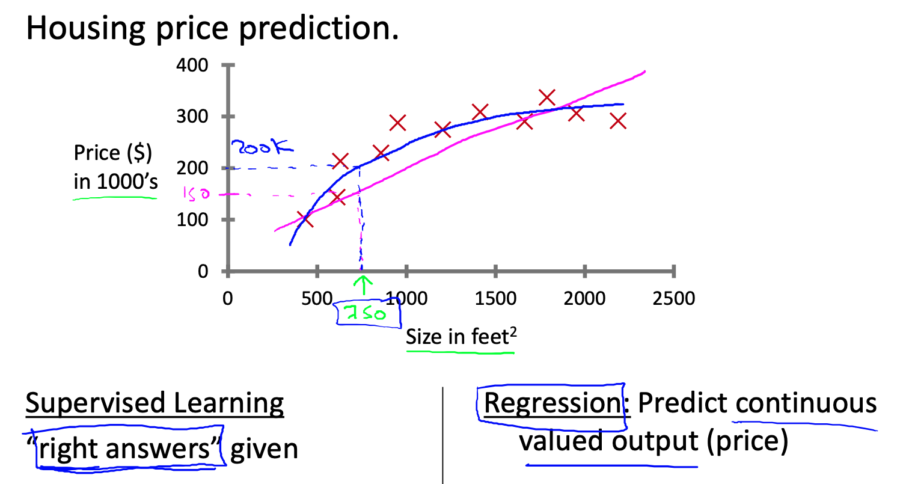
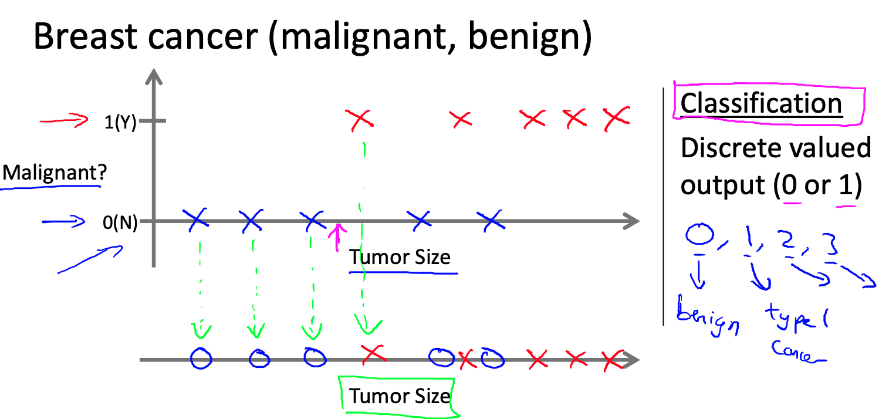

## Coursera Machine Learning — Week 1

Course by Andrew Ng from Coursera.org

## Definition of Machine Learning

* Field of study that gives computers the ability to learn without being explicitly programmed.
*  A computer program is said to learn from experience E with respect to some task T and some performance measure P, if its performance on T, as measured by P, improves with experience E.

Suppose your email program watches which emails you do or do not mark as spam, and based on that learns how to better filter spam. What is task T in this setting?

ans: Classifying emails as spam or not spam.

* Supervised learning: tech to learn (most common)
* Unsupervised learning: self-learning
* Others: Reinforcement learning, recommender systems

## Supervised Learning

**regression problem**

Housing price prediction:  -> predict price given size

**classification problem**

Breast cancer (malignant or benign):  given size predict if is malignant or benign, or the possibility of being malignant. Here tumor size called **attribute** 

There could be more than one attribute, such as age, etc.

Unsupervised Learning

The given data doesn't have any labels (there is no labeled data avalible), and find the structure from the data.

**Google News**: look up stories and categorize

**Organize computing clusters**: I had some friends looking at large data centers, that is large computer clusters and trying to figure out which machines tend to work together and if you can put those machines together, you can make your data center work more efficiently.

**Social network analysis**: given a friend circles, identify which cohesive groups of friends all know each other.

**Market segmentation**: sell diffferent products to customers.

**Cocktail party**: filter/separate different languages' voice from a single microphone.

Use Octave to implement the algorithm.