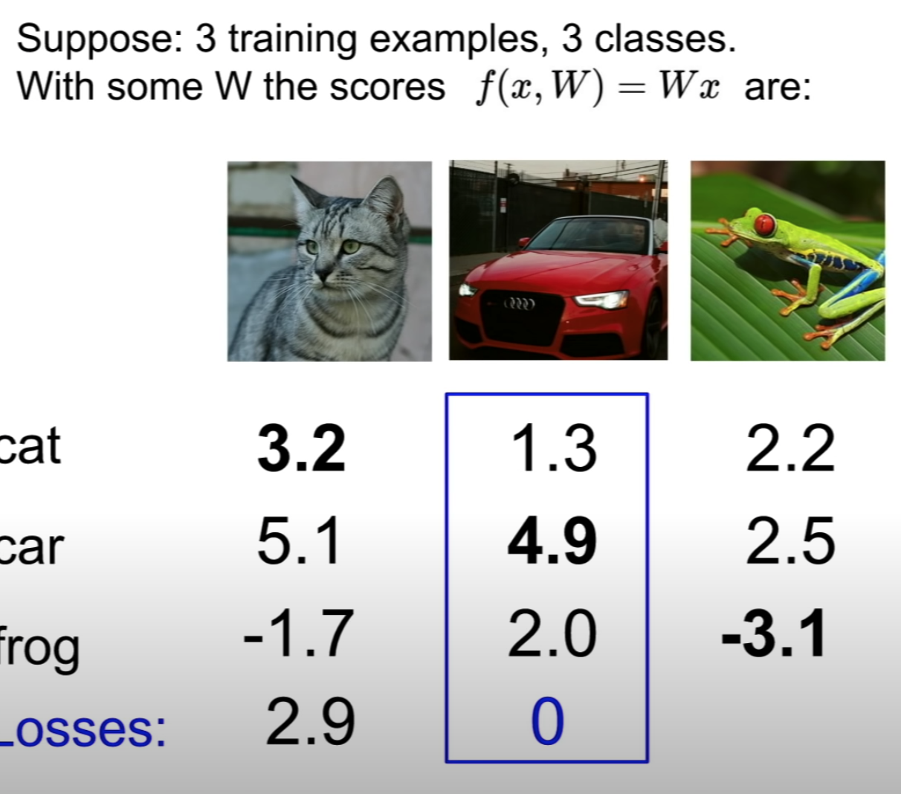

## Loss Function

### Multiclass SVM Loss: hinge loss



$S_{y_j}$ is the predict right score (target score)
$S_j$ is the predict wrong score (all the other)
\[ L_i = \sum_{j \neq y_i} max(0, S_j - S_{y_j} + 1) \]
Total Loss is:
\[ L = \frac{1}{N} \times \sum_{i = 1}^{N} L_i \]
\[ L(W) = \frac{1}{N} \times \sum_{i = 1}^{N} L_i(f(x_i, W), y_i) \]

To calculate the loss for predicting car:
max(0, cat score - car score + 1) + max(0,  frog score - car score + 1) = max(0, -2.6) + max(0, -1.9) = 0

after using the same method to calculate each of the classes, the averge is the result: (2.9 -> for cat + 0 -> for car + 12.9 -> for frog) / 3 = 5.27

### Regularization

\[ \lambda R(W) \]

This term makes sure to choose "simpler" W instead of complicated ones that only fit training data, so that the power is lower for each term (high penalty for using high power poly).

### Softmax Classifier (Multinomial Logistic Regression): cross-entropy loss

**score** is the probabilities for each class, and the sum of all classes equals to one (100%).

Loss for each category:

\[L_i = -\log P(Y = y_i | X = x_i) \]

\[P(Y = y_i | X = x_i) = \frac{e^sk}{\sum_{j} e^s j} \]

where $s$ is our model:

\[s = f(x_i;W)\]

plug in to the first equation:

\[L_i = -\log (\frac{e^sk}{\sum_{j} e^s j}) \]

The min loss is 0 and max loss is +inf

## Finding the lowest score (with respect to W) -- Optimization

1. random (never use)
2. find the slope (using gradient: numeric for debugging and analytic for calculating)

### Gradient Descent

```python
while True:
    weights_grad = evaluate_gradient(loss_fun, data, weights)
    weights += - step_size * weights_grad # perform parameter update
```

**step_size is also the learning rate, it's the first thing to set**

### Stochastic Gradient Descent (SGD)

Use when there are a lot of training set, in each iteraion, take a samples data from the training set (typically 32/64/128/256) called **minibatch**

```python
while True:
    data_batch = sample_training_data(data, 256)
    weights_grad = evaluate_gradient(loss_fun, data_batch, weights)
    weights += - step_size * weights_grad # perform parameter update
```


