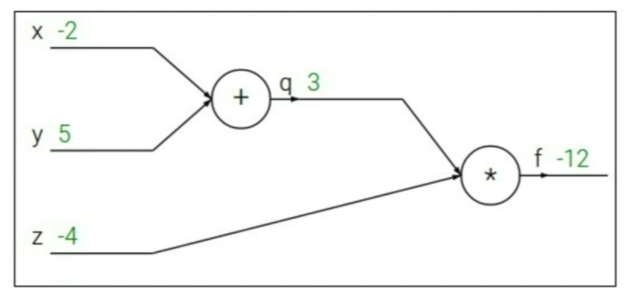
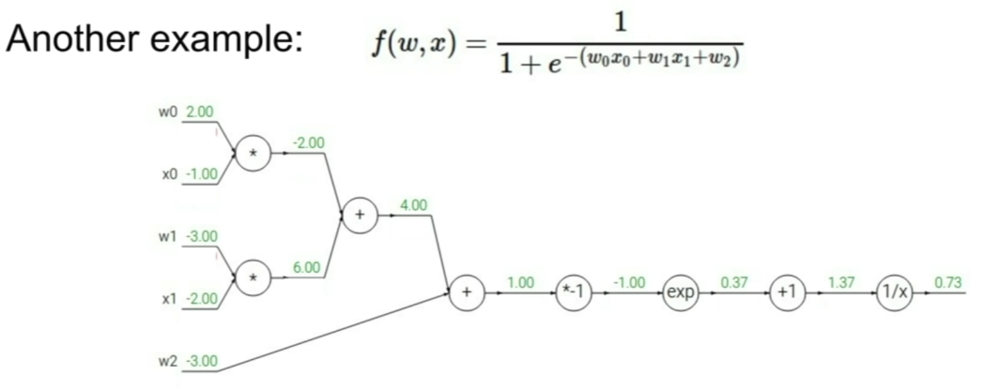
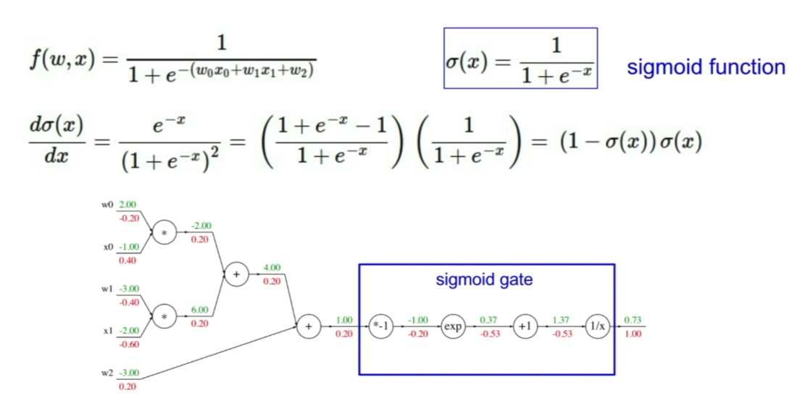
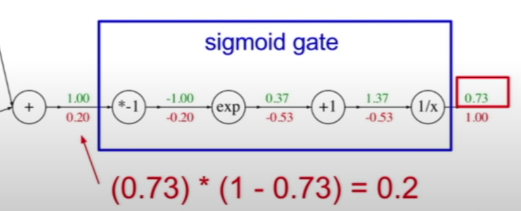
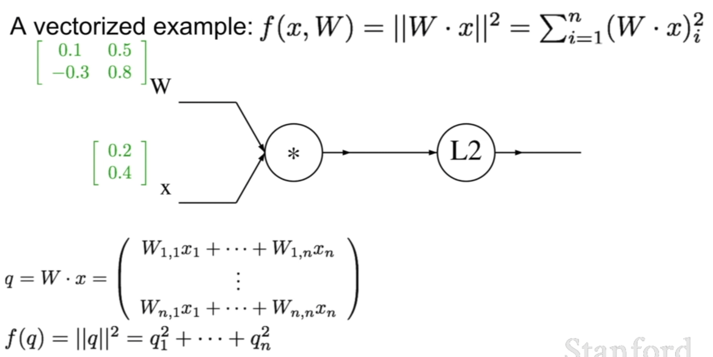

## Computation Graph


## Backpropagation: used for finding the gradient

e.g.
\[f(x,y,z) = (x + y) z\]
where x = -2, y = 5, z = -4



### Notations:

\[q = x + y\] \[\frac{\partial q}{\partial x} = 1, \frac{\partial q}{\partial y} = 1\]

\[f = qz\] \[\frac{\partial f}{\partial q} = z, \frac{\partial f}{\partial z} = q\]

goal is to find:

\[\frac{\partial f}{\partial x}, \frac{\partial f}{\partial y}, \frac{\partial f}{\partial z}\] 

In order to get all the targets, we start from the last node where

\[\frac{\partial f}{\partial f} = q = 1\]

Then find the following in sequences:
1. \[\frac{\partial f}{\partial z} = q = 1 \]
2. \[\frac{\partial f}{\partial q} = z = -4 \]
3. \[\frac{\partial f}{\partial y} = \frac{\partial f}{\partial q} \frac{\partial q}{\partial y} = -4 \times 1 = -4 \] -- using chain rule
4. \[\frac{\partial f}{\partial x} = \frac{\partial f}{\partial q} \frac{\partial q}{\partial x} = -4 \times 1 = -4 \] -- using chain rule

Using Chain rule:
Use upstreaming compound and multiple with the local compound to derive the desired partial derivative

For each node, we just need "local gradient" which is the new upstream for the next level node.

### Another Example



### Sigmoid Function



Because we already know the gradient for sigmoid function, we can just replace the sigmoid gate with the analyic gradient result.



### Patterns in backward flow

1. **add** gate: gradient distributor (split to two branches because of two terms)
2. **max** gate (e.g. max(0,1)=1): gradient router (one gradient is 0 and another is the full value)
3. **mul** gate: gradient switcher (multiple the other one to derive the current one)

## Using matrix representation (Vectorization)

Jacobian Matrix for derivative for each vector.

However, we don't need to calculate the Jacobian matrix, because each x in the row only affects the result element in the same row. Thus the matrix is diagonal.



L2 norm:

\[f(q) = ||q||^2 = q_1^2 + q_2^2 + q_3^3 ... + q_n^2 \]

Partial in respect to each q_i:

\[\frac{\partial f}{\partial q_i} = 2q_i\] or \[\nabla_q f = 2q\]

Then calculate gradient for W, we can use chain rule:

\[\frac{\partial f}{\partial W_{i,j}} = \sum_{k} \frac{\partial f}{\partial q_k} \frac{\partial q_k}{\partial W_{i,j}}\]
\[= 2^k q_i  x_j \]

## Implement forward and backword for different gates

```python
class MultiplyGate(object):
    def forward(x,y):
        return x * y
    def backward(dz):
        dx = self.y * dz # cache y
        dy = self.x * dz
        return [dx, dy]
```

where [dx, dy] is:

\[\frac{\partial L}{\partial x}, \frac{\partial L}{\partial y} \] and dz is: \[\frac{\partial L}{\partial z}\]


