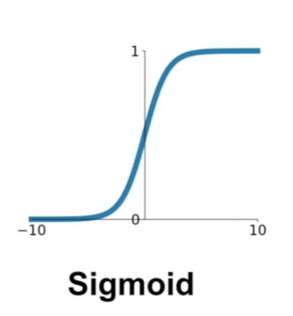
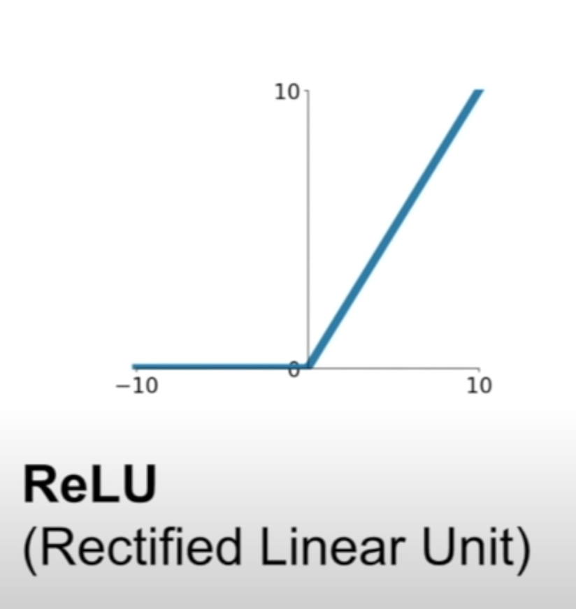
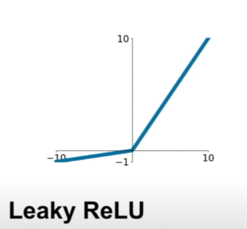
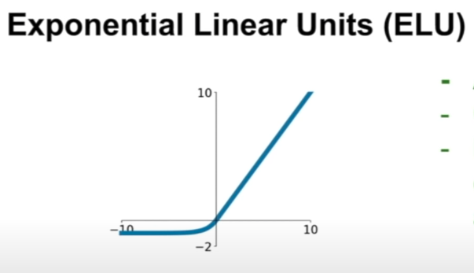

## Overview
1. One-time setup: activation functions, preprocessing, weight initialization, regularization, gradient checking
2. Training dynamics: babysitting the learning process, parameter updates, hyperparameter optimization
3. Evaluation: model ensembles

## Part 1

- Activation functions
- Data preprocessing
- Weight initialization, 
- Batch Normalization
- Babysitting the learning process
- Hyperparameter Optimization

### Activation Function

#### Sigmoid

\[\sigma(x)=\frac{1}{1+e^{-x}}\]

- if get high value -> approach to 1, low -> 0
- problem 1: if **too** large, then the value is 1, or **too** small, then the value is 0 (killed gradient when saturated)
- problem 2: not zero-centered (gradient on w is always all positive or negative) which makes the parameter update inefficient
- problem 3: $e^{-x}$ is computation expensive

#### tanh

\[tanh(x)\]

- in a range of [-1, 1]
- it's now zero centered (flip between - and + for same weight)
- problem 1: still kill gradient when saturated

#### ReLU

\[f(x)=max(0,x)\]

- doesn't saturated **in positive region**
- computation efficient
- converge faster than sigmoid and tanh
- biologically plausible than sigmoid
- problem 1: not zero-centered
- problem 2: negative still saturated (annoyance, dead relu region)

#### Leaky ReLU and Parametric Rectifier

\[f(x)=max(0.01x, x)\] and \[f(x)=max(\alpha x, x)\]

- Does not saturate
- Computationally efficient
- Converge much faster than sigmoid/tanh in practice
- will not "die"  (no plateau)

#### Exponential Linear Unit (ELU)

f(x)=x if x > 0
f(x)= alpha (exp(x)-1) if x <= 0

- all benefits of ReLU
- closer to zero mean outputs
- negative saturation regime compared with Leaky ReLU adds some robustness to noise
- problem 1: computation requires exp()

#### Conclusion

- Use ReLU
- Try out Leaky ReLU/Maxout/ELU
- Try tanh but don't expect too much
- Don't use sigmoid

### Data Preprocessing

for image, stick with zero-mean

