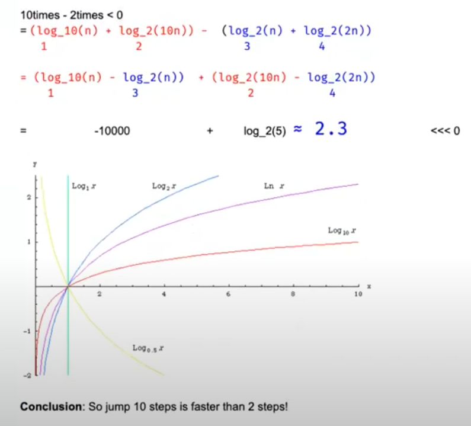

# Binary Search

**2 Principles:**
1. Guarantee that the search space decreases over time (after each iteration). // prevent while "true"
2. Guarantee that the target (if exist) cannot be ruled out accidentally, when we change the value of Left or Right.

while (l <= r): 1 element **can** get in
while (l < r): 1 element **cannot** get in

l = l + 1: eleminate l for next iteration
l = l: check if 1 element will cause inf

## 2D Space Binary Search

1 3 4 6
7 9 10 11
14 17 19 20
target = 11

index = col * row - 1
col = index / size of col
row = index % size of col

```c
int l = 0, r = col * row - 1;
while (l <= r) {
    int m = (l + r) >> 1;
    int x = m / col, y = m % col;
    if (a[x][y] == target) return true;
    else if (a[x][y] < target) l = m + 1;
    else r = m - 1;
}
return false;
```

## Closest Element to Target

target == 4
[1,2,3,8,9] -> return 3's index which is 2

```c
while (l < r - 1) { // only two (or one) element left [l, l+1] or [l]
    int m = l + (r - l) / 2;
    if (a[m] == target) {
        return m;
    } else if (a[m] < target) {
        l = m;
    } else {
        r = m;
    }
}
if (target - a[l] < a[r] - target) // return the one that is close to target, because there are two elements
    return l;
else
    return r;
```

## First target

target = 5
[4,5,5,5,5,5] -> return 1 (first occurance of 5 index)

```c
while (l < r - 1) { // only two (or one) element left [l, l+1] or [l]
    int m = l + (r - l) / 2;
    if (a[m] == target) {
        r = m; // r = m - 1 -> wrong
    } else if (a[m] < target) {
        l = m; // l = m + 1 -> right
    } else {
        r = m; // r = m - 1 -> right
    }
}
if (target == a[l]) // return the left that is equal to target, because it goes from left to right
    return l;
if (target == a[r])
    return r;
else
    return -1;
```

## Last target (variant for previous one)

target = 5
[4,5,5,5,5,5] -> return 1 (first occurance of 5 index)

```c
while (l < r - 1) { // only two (or one) element left [l, l+1] or [l]
    int m = l + (r - l) / 2;
    if (a[m] == target) {
        l = m; // now change to l
    } else if (a[m] < target) {
        l = m;
    } else {
        r = m;
    }
}
if (target == a[r]) // return the right that is equal to target, because it goes from right to left
    return l;
if (target == a[l])
    return r;
else
    return -1;
```

## Closest k Elements

how to return the index of k elements that are closest elements to the target
k = 3, target = 5, a = [1,2,3,8,9]
return 2,3,8

Solution 1:
1. run binary search to find L and R.
2. if l is close to target, l--; else r++
Complexity: O(log(n) + k)

```c
while (l < r - 1) { // only two (or one) element left [l, l+1] or [l]
    int m = l + (r - l) / 2;
    if (a[m] == target) {
        r = m;
    } else if (a[m] < target) {
        l = m;
    } else {
        r = m;
    }
}
```

Solution 2:
1. binary search to find L and R
2. using offset to form two more arrays:
  leftArray = {3 2 1} rightArray = {4 5}
  then use the method introduced [later](#kth-smallest-in-two-sorted-arrays) to find the median. Don't need to preprocess the offset beforehand, but just to update when visited.

Solution 3:
Moving the sliding window to get the least sum diff. To get the minimal, it has to be the mid point of the sliding window.
case 1: x - A[mid] < A[mid + k] - x, need to move window go left
-------x----A[mid]-----------------A[mid + k]----------

case 2: x - A[mid] < A[mid + k] - x, need to move window go left again
-------A[mid]----x-----------------A[mid + k]----------

case 3: x - A[mid] > A[mid + k] - x, need to move window go right
-------A[mid]------------------x---A[mid + k]----------

case 4: x - A[mid] > A[mid + k] - x, need to move window go right
-------A[mid]---------------------A[mid + k]----x------

```c
  vector<int> kClosest(vector<int> a, int x, int k) {
    int n = a.size();
    int l = 0, r = n - k;
    while (l < r) {
      int m = (l + 0ll + r) >> 1;
      if (x - a[m] > a[m + k] - x)
        l = m + 1;
      else
        r = m;
    }
    auto res = vector<int>(a.begin() + l, a.begin() + l + k );
    // this sort is unecessary if there is no requirement for what order to be returned
    // sort(res.begin(), res.end(), [&](const int l, const int r) {
    //   return abs(l - x) < abs(r - x);
    // });
    return res;
  }
```

## Smallest element that is greater than target

sss eee bbb -> same as first target, because we want to find the first b

case 1: if input[m] < target:
  l = m + 1 // l = m also work
case 2: if input[m] == target:
  l = m + 1 // l = m also work
case 3: if input[m] > target:
  r = m // r = m - 1 is wrong, becasue it will wipe out the first b

```c
while (l < r - 1) { // only two (or one) element left [l, l+1] or [l]
    int m = l + (r - l) / 2;
    if (a[m] > target) {
        r = m;
    } else if (a[m] <= target) { // or just else
        l = m;
    }
}
if (a[l] > target)
    return l;
if (a[r] < target)
    return r;
return -1;
```

## Kth smallest in two sorted arrays

1. how to find the **median**
2. how to find k-th smallest element from them

A[] = {2,5,7,10,13}
B[] = {1,3,4,13,20,29}
k = 5
output = 5

solution 1: two pointer, i++ if a[i] < b[j] else j++, stop until k steps -> O(k)

solution 2: binary search


## Binary Search with Unknown Size

dict = {1 3 5 6 .... 1000000}, target = 9999
Assumption:
- No dict.size()
- if dict.get(index) == null, then we know the size of dict is < index.

solution 1:
1. keep jumping out with size = size * 2. until dict.get(index) == null
2. do binary search from 0 to current size

Followup:
Why not size = size * 10? Which one is better?
> Don't say an answer (if you don't know yet), but say let's analyze together.





